🍽️ QR Code-Based Ordering System for Restaurants
🚀 Live Demo: https://full-stack-project3.onrender.com/user/landing

📖 Overview
A modern, tech-driven solution for restaurants! Customers can scan QR codes or tap NFC tags to view the digital menu, place orders, and track them — all without waiting for a waiter! Restaurant admins get access to real-time analytics, order management, and dynamic menu controls.

✨ Features
👥 Customer Side:
📱 QR Code/NFC Access – Instantly view the menu by scanning or tapping.

🍔 Browse Menu – Explore categories, descriptions & prices.

🛒 Place Orders – Customize and order food seamlessly.

🔔 Order Tracking – Track the order status live (Pending → Preparing → Ready).

🛠️ Admin Side:
📊 Dashboard Analytics – Monitor profits (daily, monthly, yearly) with interactive graphs.

⭐ Top Menu Insights – Identify best-selling items & categories.

✅ Order Management – Accept or reject orders in real-time.

🍽️ Menu Management – Add, edit, or delete menu items and categories.

⏳ Pending Orders View – Handle all current orders efficiently.

🛠️ Tech Stack
Frontend : HTML, CSS, JavaScript
Backend : Node.js, Express.js
Database : MongoDB
Tools : QR Code & NFC Integration, Chart.js

🚀 Future Enhancements
💳 Online Payment Integration (UPI, Cards, Wallets)

🏢 Multi-Branch Support (Manage multiple restaurant locations)

⭐ Customer Feedback & Ratings System

🏁 Conclusion
This system transforms traditional restaurant ordering with a contactless, efficient, and interactive experience for both customers and owners. Enhance customer satisfaction, reduce wait times, and gain valuable insights!

## 📸 Screenshots

### 👤 User Side

- **Landing Page**
  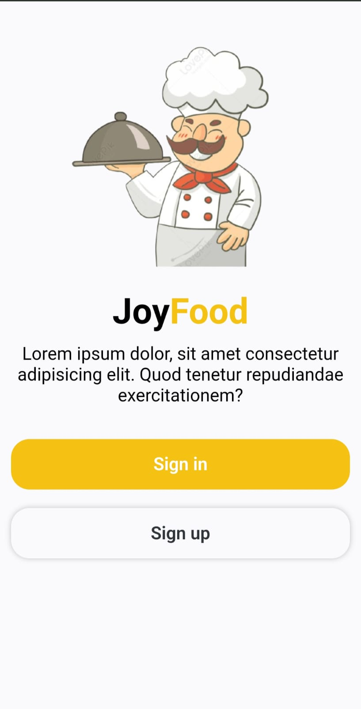

- **Home Page**
  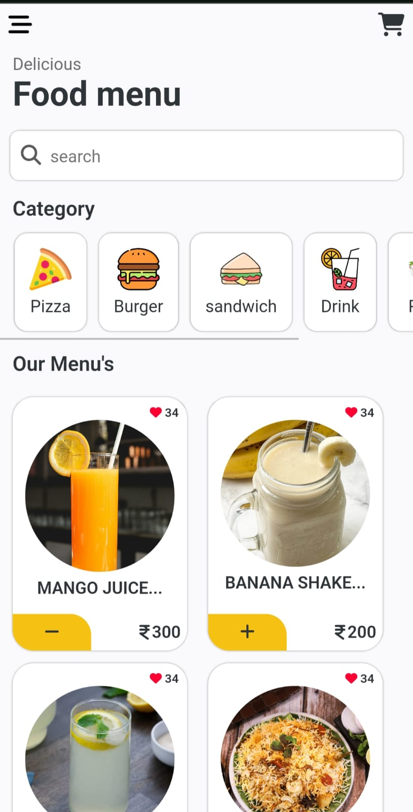

- **Category Page**
  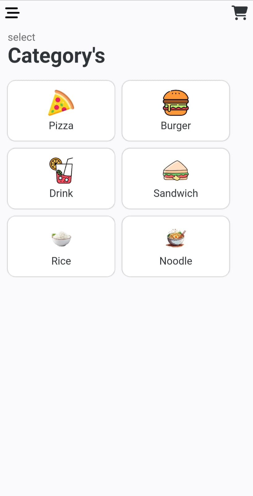

- **Best Selling Menu Page**
  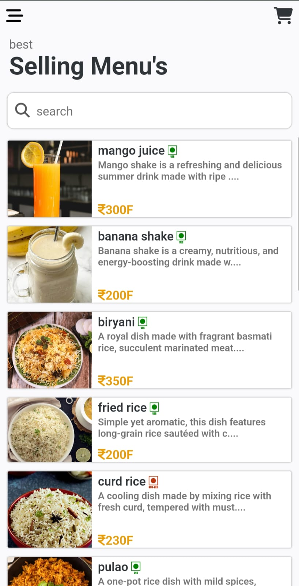

- **Cart Page**
  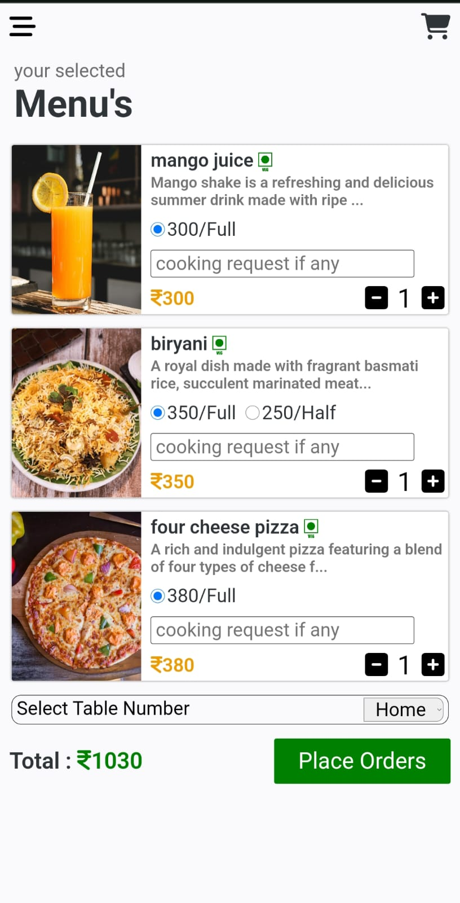

- **Order Status Page**
  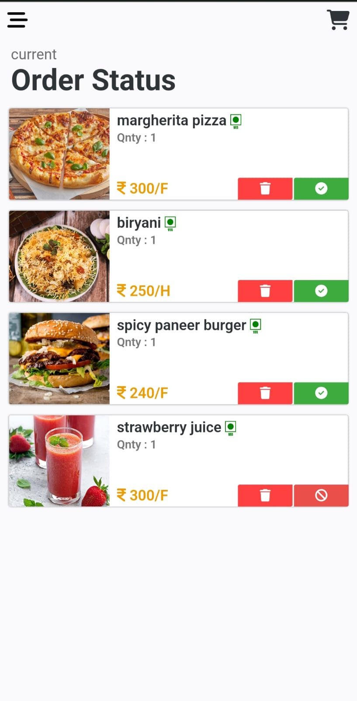

- **Order History Page**
  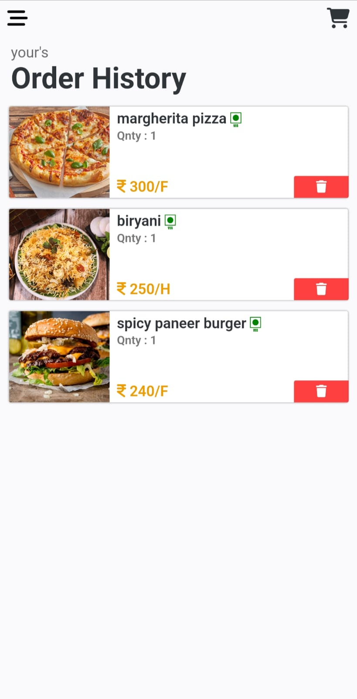

- **User Sign In Page**
  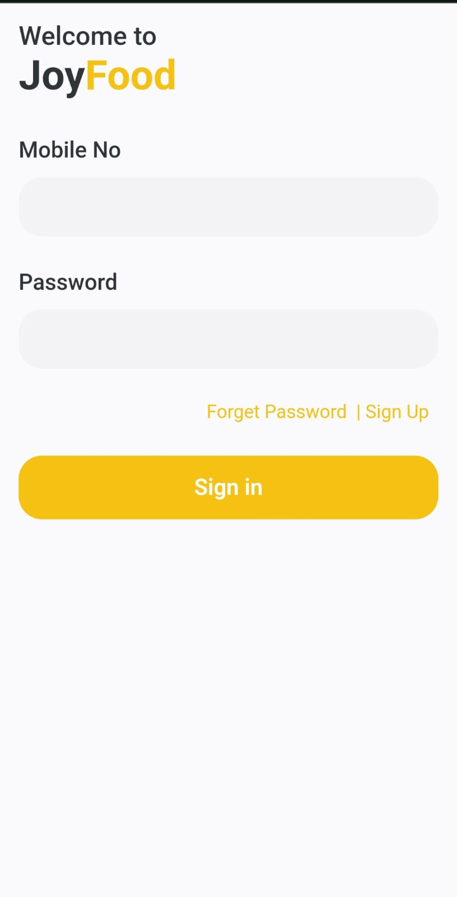

- **User Sign Up Page**
  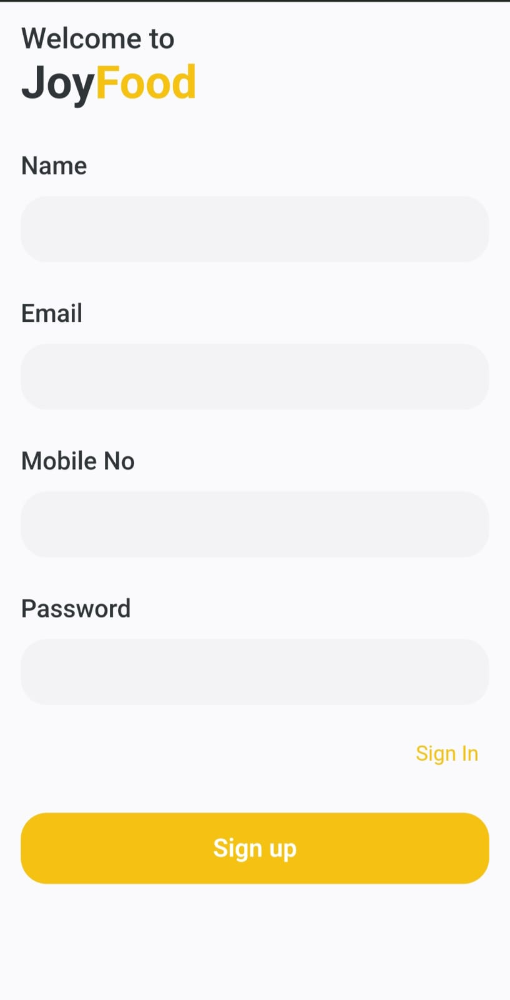

---

### 🛠️ Admin Side

- **Admin Landing Page**
  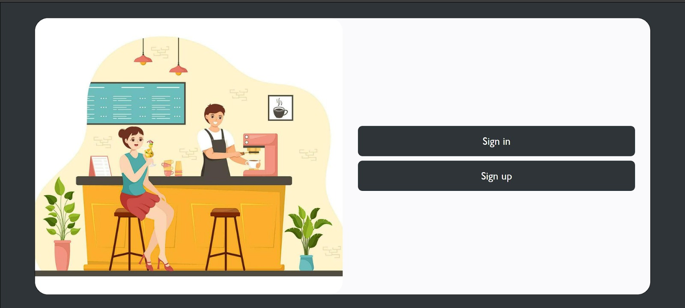

- **Admin Dashboard Page**
  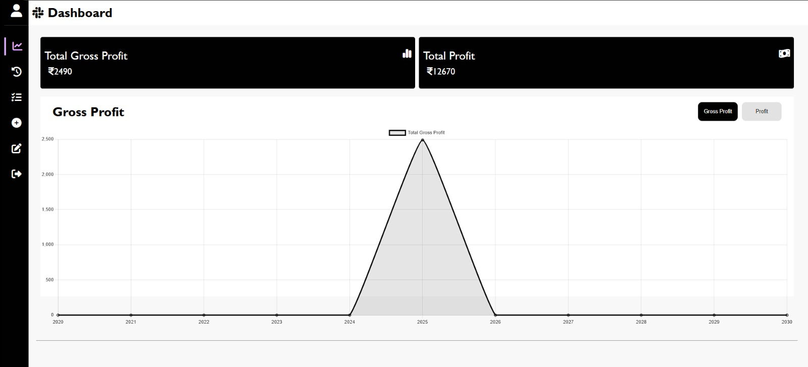

- **Admin Dashboard Page 2**
  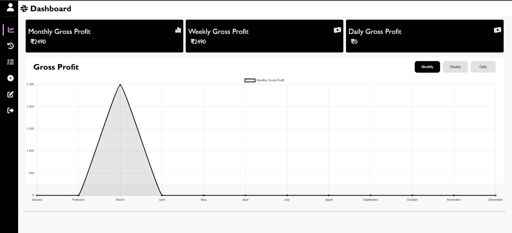

- **Admin Dashboard Page 3**
  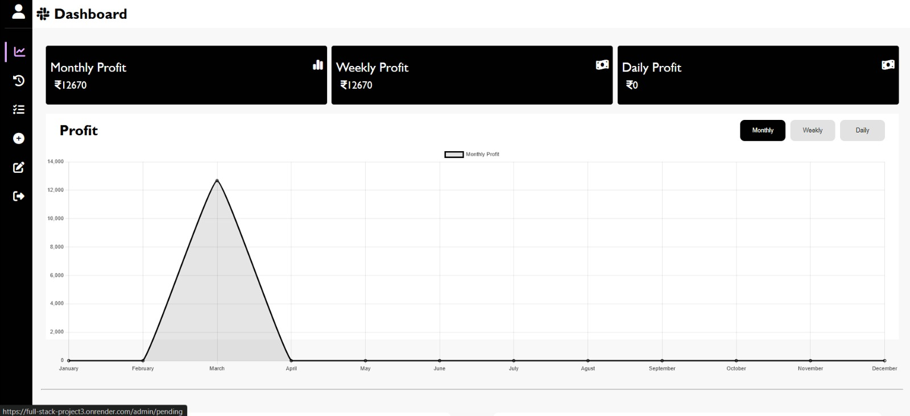

- **Admin Dashboard Page 4**
  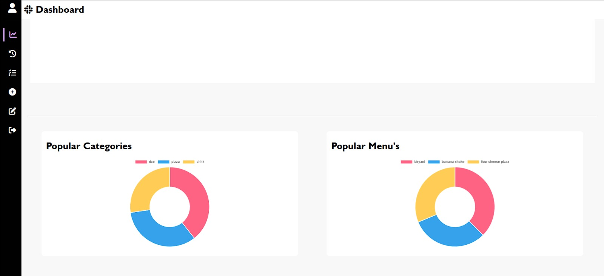

- **Admin Pending Orders Page**
  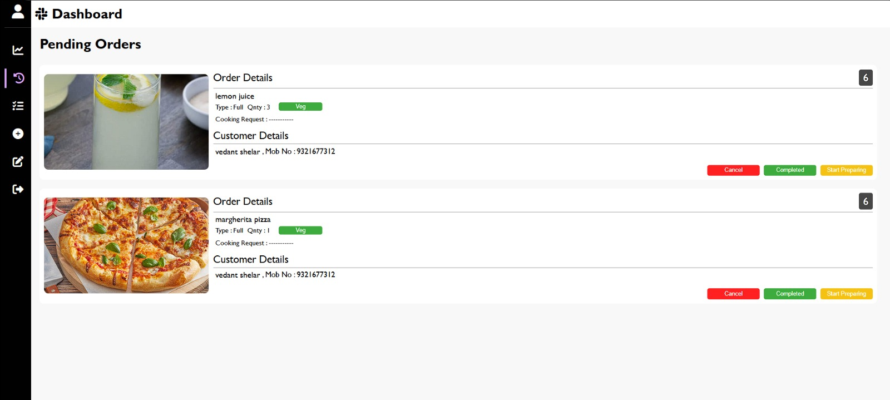

- **Admin Complete Order Page**
  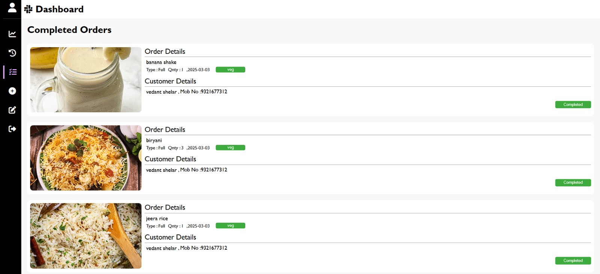

- **Admin Add Menu Form Page**
  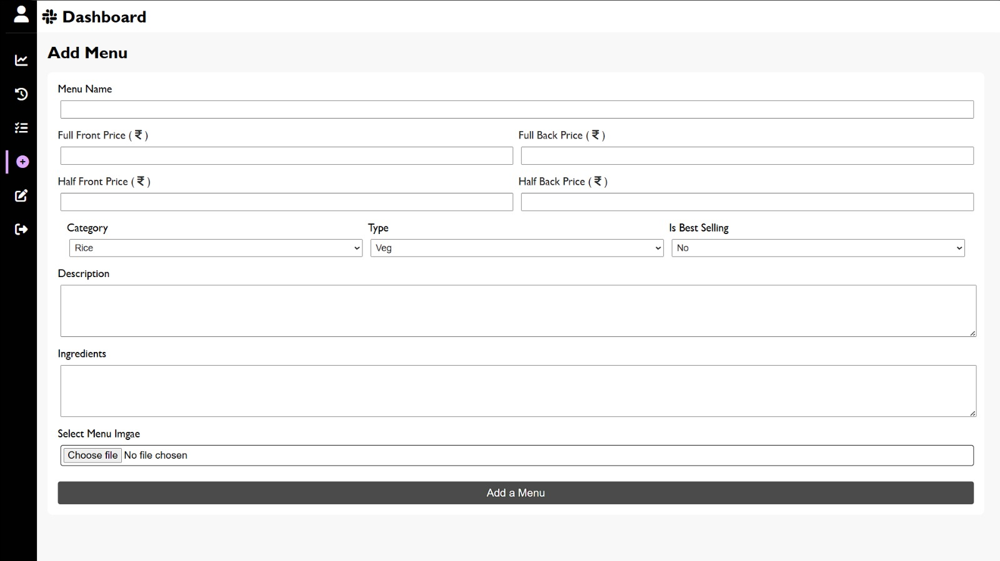

- **Admin Edit Menu Page**
  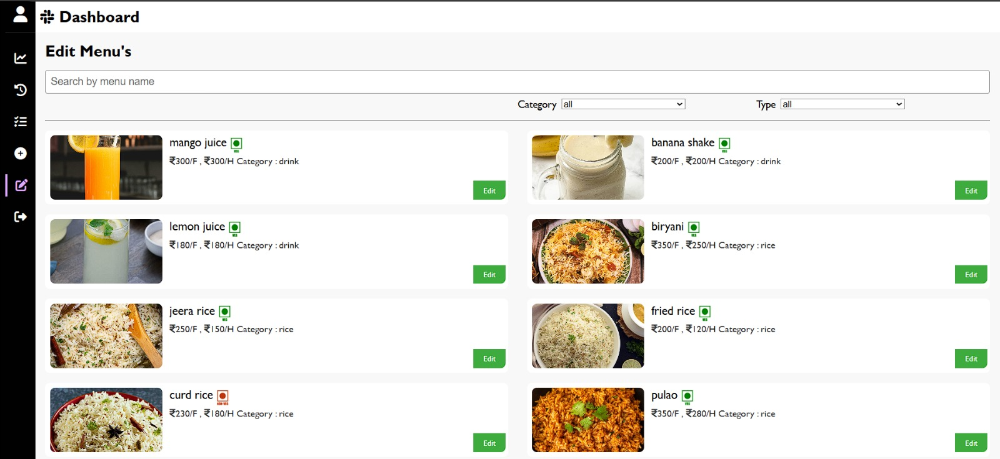

- **Admin Sign In Page**
  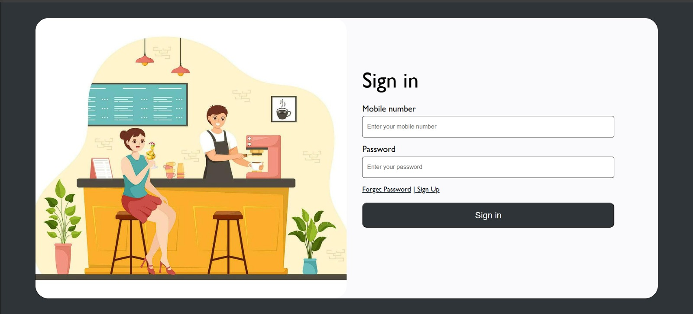

- **Admin Sign Up Page**
  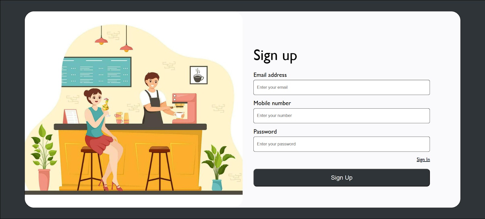

